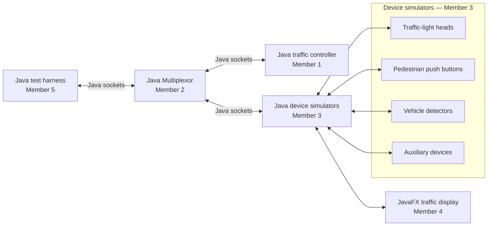

# Traffic Flow Controller System Architecture

## Purpose

The complete system is written in Java. It uses Java socket classes for communication and JavaFX for the visual intersection. The traffic controller decides the signal state, simulated devices send and receive updates, and JavaFX displays the result. Each road has six lanes: three lanes travel in one direction and three travel in the opposite direction, separated by a yellow center line.

## Component view

