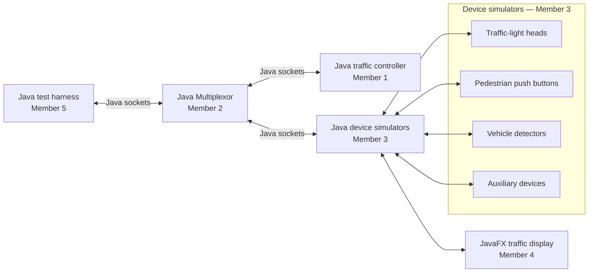

# Traffic Flow Controller System Architecture

## Purpose

The complete system is written in Java. It uses Java socket classes for communication and JavaFX for the visual intersection. The traffic controller decides the signal state, simulated devices send and receive updates, and JavaFX displays the result. Each road has six lanes: three lanes travel in one direction and three travel in the opposite direction, separated by a yellow center line.

## Component view

## Module ownership and boundaries

| Module | Owner | Owns | Does not own |
| --- | --- | --- | --- |
| Traffic Controller | Member 1 | Java control logic and signal timing | Socket routing or JavaFX drawing |
| Multiplexor | Member 2 | Java `ServerSocket` connections and message routing | Traffic-control decisions |
| Device Simulators | Member 3 | Java device state and command handling | Signal timing rules |
| JavaFX Simulator | Member 4 | Intersection display and vehicle animation | Controller decisions |
| Main Test Harness | Member 5 | Java test scenarios and result checks | Production control logic |
