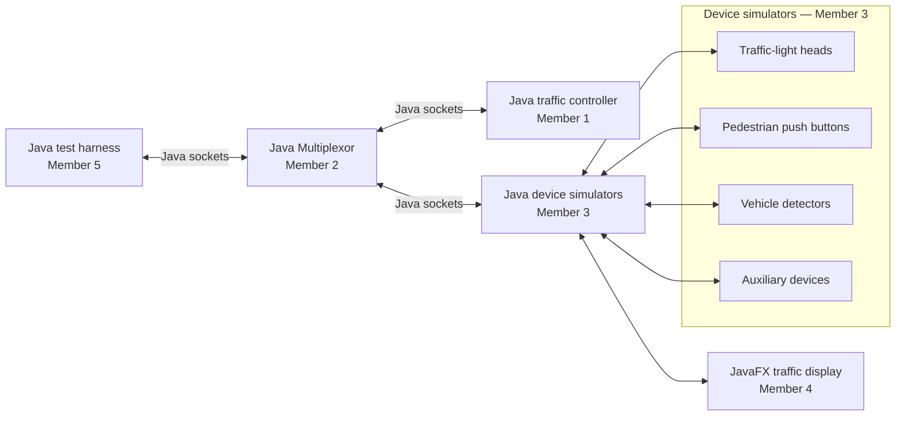

# Traffic Flow Controller System Architecture

## Purpose

The complete system is written in Java. It uses Java socket classes for communication and JavaFX for the visual intersection. The traffic controller decides the signal state, simulated devices send and receive updates, and JavaFX displays the result. Each road has six lanes: three lanes travel in one direction and three travel in the opposite direction, separated by a yellow center line.

## Component view

## Module ownership and boundaries

| Module | Owner | Owns | Does not own |
| --- | --- | --- | --- |
| Traffic Controller | Member 1 | Java control logic and signal timing | Socket routing or JavaFX drawing |
| Multiplexor | Member 2 | Java `ServerSocket` connections and message routing | Traffic-control decisions |
| Device Simulators | Member 3 | Java device state and command handling | Signal timing rules |
| JavaFX Simulator | Member 4 | Intersection display and vehicle animation | Controller decisions |
| Main Test Harness | Member 5 | Java test scenarios and result checks | Production control logic |

## Road layout

- Each road contains six lanes in total.
- Three lanes carry traffic in one direction and three lanes carry traffic in the opposite direction.
- A yellow center line separates the two directions of travel.
- JavaFX vehicles must move only in the direction assigned to their lane.
- The traffic lights control both opposing approaches at the intersection.

## System rules

- All modules use Java; JavaFX is used only for the user interface.
- Modules communicate with Java `Socket` and `ServerSocket` classes.
- Each device has a unique ID such as `light-north` or `button-east`.
- The Multiplexor routes text messages but does not make traffic decisions.
- Only the controller changes traffic-light states.
- The controller starts all lights red and uses green, yellow, and all-red phases.
- If the controller disconnects, the Multiplexor notifies the device hub and
  the device hub returns traffic lights to red. Socket loss also triggers this
  device-side fail-safe.

## Control loop

1. A Java detector or push-button object sends an `EVENT` message.
2. The Java Multiplexor forwards it to the controller.
3. The controller sends a `COMMAND` to the correct traffic light.
4. The device replies with its new `STATE`.
5. The device simulator passes the same state to JavaFX over their direct
   simulator connection; the Multiplexor never broadcasts one message to two
   destinations.

## Controller state machine

The controller groups north/south and east/west as non-conflicting movements.
It starts all-red and serves demand from vehicle detectors and pedestrian
buttons. An active green lasts at least 5 seconds and at most 15 seconds. A
waiting opposing request causes this transition: green → 2-second yellow →
1-second all-red → opposing green. Auxiliary `FAULT` or `OFFLINE` reports
force the controller to all-red immediately.

The production entry point is
`trafficcontrol.controller.TrafficController`. It connects to the
Multiplexor, registers as `controller`, validates incoming messages, and sends
`SET_COLOR` commands. Signal timing stays in the controller; socket routing
stays in the Multiplexor.
